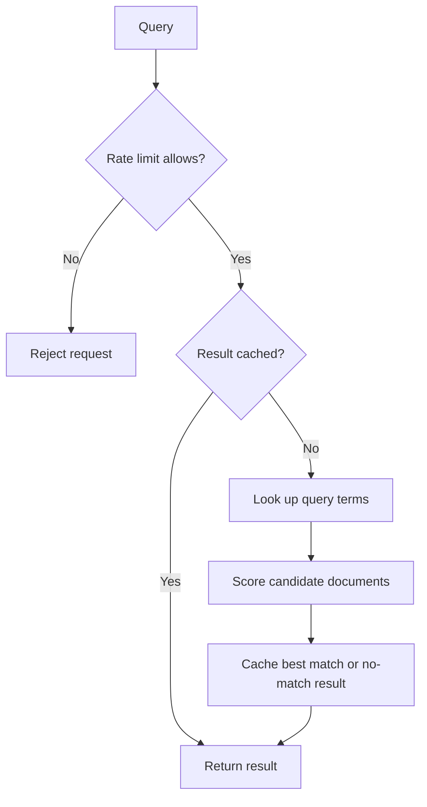

# Document Search Engine

A C++17 document retrieval engine that combines **inverted indexing**, **LRU caching**, and **per-user rate limiting**. It searches a local document collection, ranks candidate documents by matching query terms, and reuses cached results for repeated queries.

The project implements the keyword retrieval stage of a RAG-inspired architecture. Its focus is retrieval and request handling; results are source documents rather than generated answers.

## Core features

- **Inverted index:** maps normalized words to document IDs, so each query visits the posting lists for its terms instead of scanning every document.
- **Document ranking:** counts distinct matching query terms and returns the highest-scoring document. Ties resolve to the earliest document in the collection.
- **LRU cache:** combines a hash map with a doubly linked list for average O(1) lookup and recency updates, excluding string hashing and copying costs.
- **Three rate limiters:** token bucket, leaky bucket admission control, and fixed window, each with independent state per user ID.
- **Interactive demo:** displays cache hits, cache misses, retrieved documents, and rejected requests while comparing the three algorithms.
- **Regression tests:** cover retrieval, eviction, rate-limit boundaries, invalid settings, and CLI termination.

## Request flow



Rate limiting runs before cache lookup, so cached requests also consume an allowance. A cache holds up to five results and remains shared across demo stages; each stage starts with a fresh rate limiter.

## Build and run

Requirements: a C++17 compiler. The application has no third-party dependencies.

From the repository root:

```sh
g++ -std=c++17 -O2 -Wall -Wextra -Wpedantic main.cpp -o search_engine
./search_engine
```

With GNU Make installed, `make` builds the same executable. Run it from the repository root so it can find `documents.txt`.

The CLI starts with three demo stages:

1. Token bucket: capacity of 3 requests, refilling at 1 token per second.
2. Leaky bucket: capacity of 3 requests, draining at 1 request per second.
3. Fixed window: up to 3 requests per 5-second window.

Enter a search query at any stage. Type `next` to advance or `exit` to quit immediately. After the third stage, the application enters normal search mode with token bucket rate limiting. End-of-input also exits cleanly.

Try `binary search tree` twice to see a cache miss followed by a cache hit:

```text
ALLOWED [CACHE MISS]
  -> A binary search tree maintains the property that left children are smaller and right children are larger than the parent node

ALLOWED [CACHE HIT]
  -> A binary search tree maintains the property that left children are smaller and right children are larger than the parent node
```

Submit four queries within one second to see token bucket rejection. Typing slowly gives the bucket time to refill.

## Run tests

Tests require Python 3 for CLI checks and GNU Make for the combined command:

```sh
make test
```

Without Make, after building the application:

```sh
g++ -std=c++17 -O2 -Wall -Wextra -Wpedantic -I. tests/unit_tests.cpp -o unit_tests
./unit_tests
python3 tests/test_cli.py ./search_engine
```

The suite contains 71 C++ checks and five Python CLI tests. Rate limiter tests use an injected monotonic clock to verify refill, drain, and reset boundaries without sleeping. CLI tests exercise `exit` and end-of-input at every stage, retrieval and caching, normal search mode, and missing document files.

## Design decisions

### Retrieval and ranking

Each nonempty, searchable line in `documents.txt` is a document. The included collection contains 20 documents about algorithms and data structures. Tokenization lowercases alphanumeric characters, splits on punctuation and whitespace, and deduplicates terms.

The score is the number of distinct query terms present in a document. Repeating a term does not increase its weight. No matching terms produces an empty result with score 0. Loading a collection again replaces the existing index; failure to open a file preserves the current collection.

For a query with distinct terms `Q`, retrieval visits `sum(|postings(term)|)` entries across those terms, then examines the candidate scores. Common terms can still touch most of the collection. This is a keyword-overlap baseline that can be extended with TF-IDF or BM25.

### Cache behavior

The most recently accessed entry sits at the front of a linked list. A hash map points directly to each entry, allowing lookup, promotion, and eviction without scanning the list. Insertion into a full cache removes the entry at the back.

Cache keys use the original query string. Case or punctuation variants may therefore occupy separate entries even when retrieval treats them equivalently. Nonpositive cache capacities are rejected.

### Rate limiting

| Algorithm | State | Recovery | Trade-off |
| --- | --- | --- | --- |
| Token bucket | Available tokens per user | Tokens refill continuously up to capacity | Supports bounded bursts and gradual recovery. |
| Leaky bucket admission control | Bucket level per user | Level drains continuously toward zero | Rejects overflow; accepts bursts up to capacity and does not queue or pace execution. |
| Fixed window | Request count and window start per user | Count resets on the first request after expiry | Simple accounting; requests can cluster around a window boundary. |

For buckets, the constructor's `rate` argument means requests per second. For fixed windows, it means seconds per window. Capacity must be a positive integer, and rate or duration must be positive and finite. Timing uses `std::chrono::steady_clock`.

## Source layout

| File | Responsibility |
| --- | --- |
| `SearchEngine.h` | Document loading, tokenization, inverted indexing, and ranking |
| `LRUCache.h` | Cache lookup, recency tracking, and eviction |
| `RateLimiter.h` | Three rate-limiting algorithms and per-user state |
| `main.cpp` | Interactive demo and query processing |
| `documents.txt` | Sample document collection |
| `tests/` | Component checks, search fixtures, and CLI regression tests |
| `Makefile` | Build, test, and cleanup commands |

## Scope and next steps

The current implementation is an in-memory, single-threaded CLI. The demo uses one user ID, while the limiter supports separate allowances for multiple IDs. Per-user state is retained for the lifetime of the limiter. Tokenization is byte-based and intended for the included English text collection.

Further work includes weighted ranking, normalized cache keys, expired-user cleanup, concurrency support, and benchmarks comparing indexed retrieval with a full scan. Performance measurements will be added when those benchmarks are implemented.
